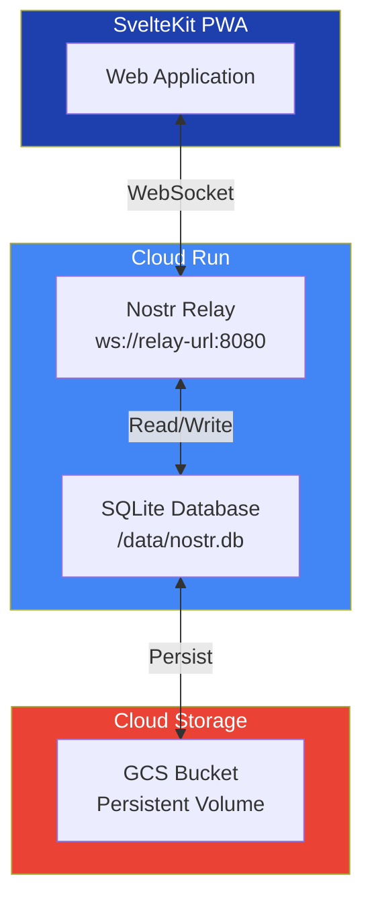

# Nostr Relay Service - SQLite for Cloud Run

**Private, whitelist-only relay with SQLite storage. Optimized for Cloud Run deployment.**

## Features

- ✅ **Private Access**: Whitelist-only, no federation with external relays
- ✅ **Point-to-Point**: Direct communication within the application
- ✅ **SQLite Storage**: Single-file database, perfect for Cloud Run
- ✅ **NIP Support**: NIP-01 (events and filters)
- ✅ **Cloud Run Ready**: No separate database service needed
- ✅ **Pure JavaScript**: No native dependencies (sql.js)
- ✅ **WebSocket**: Real-time event streaming

## Architecture



## Quick Start

### Prerequisites

- Node.js 20+ (for local development)
- Docker (for containerized deployment)
- Google Cloud SDK (for Cloud Run deployment)

### 1. Local Development

```bash
cd services/nostr-relay

# Install dependencies
npm install

# Build
npm run build

# Start relay (creates ./data/nostr.db)
npm start
```

### 2. Docker Deployment

```bash
# Build Docker image
docker build -t nostr-relay .

# Run locally with volume
docker run -d \
  -p 8080:8080 \
  -v $(pwd)/data:/data \
  -e SQLITE_DATA_DIR=/data \
  -e WHITELIST_PUBKEYS="" \
  nostr-relay

# View logs
docker logs -f nostr-relay
```

### 3. Cloud Run Deployment

See **[docs/CLOUD_RUN_DEPLOYMENT.md](docs/CLOUD_RUN_DEPLOYMENT.md)** for complete Cloud Run deployment guide.

### 4. Configure Whitelist

Edit `.env` file:
```bash
# Empty = development mode (all pubkeys allowed)
WHITELIST_PUBKEYS=

# Production = comma-separated hex pubkeys
WHITELIST_PUBKEYS=abc123...,def456...,ghi789...
```

Note: Current simple implementation uses environment variables. Advanced whitelist management (cohorts, expiry) requires extending the implementation.

## Configuration

### Environment Variables

Create `.env` file in `services/nostr-relay`:

```bash
# Server Configuration
PORT=8080
HOST=0.0.0.0

# SQLite Configuration
SQLITE_DATA_DIR=/data

# Whitelist Configuration
# Empty = development mode (allows all)
# Production = comma-separated pubkeys
WHITELIST_PUBKEYS=

# Example with pubkeys:
# WHITELIST_PUBKEYS=abc123...,def456...,ghi789...
```

### Dockerfile

The relay uses a multi-stage Docker build:

```dockerfile
FROM node:20-alpine AS builder
WORKDIR /app
COPY package*.json ./
RUN npm ci
COPY tsconfig.json ./
COPY src ./src
RUN npm run build

FROM node:20-alpine
WORKDIR /app
COPY package*.json ./
RUN npm ci --omit=dev
COPY --from=builder /app/dist ./dist
RUN mkdir -p /data && chown -R node:node /data
ENV NODE_ENV=production
ENV PORT=8080
ENV HOST=0.0.0.0
ENV SQLITE_DATA_DIR=/data
USER node
EXPOSE 8080
CMD ["node", "dist/server.js"]
```

## Database Management

### Schema

The relay uses a simple SQLite schema (see `schema.sql`):

```sql
CREATE TABLE IF NOT EXISTS events (
  id TEXT PRIMARY KEY,
  pubkey TEXT NOT NULL,
  created_at INTEGER NOT NULL,
  kind INTEGER NOT NULL,
  tags TEXT NOT NULL,
  content TEXT NOT NULL,
  sig TEXT NOT NULL,
  received_at INTEGER DEFAULT (strftime('%s', 'now'))
);

CREATE INDEX IF NOT EXISTS idx_pubkey ON events(pubkey);
CREATE INDEX IF NOT EXISTS idx_kind ON events(kind);
CREATE INDEX IF NOT EXISTS idx_created_at ON events(created_at DESC);
```

### Database Operations

**View Events** (requires sqlite3):
```bash
sqlite3 ./data/nostr.db "SELECT id, kind, created_at FROM events ORDER BY created_at DESC LIMIT 10;"
```

**Count Events**:
```bash
sqlite3 ./data/nostr.db "SELECT COUNT(*) FROM events;"
```

**Backup Database**:
```bash
# Simple file copy
cp ./data/nostr.db ./backup_$(date +%Y%m%d_%H%M%S).db

# For Cloud Run
gsutil cp gs://PROJECT-nostr-data/nostr.db ./backup.db
```

**Restore Database**:
```bash
# Local
cp ./backup.db ./data/nostr.db

# Cloud Run
gsutil cp ./backup.db gs://PROJECT-nostr-data/nostr.db
```

**Database Statistics**:
```bash
sqlite3 ./data/nostr.db "
  SELECT
    kind,
    COUNT(*) as count,
    COUNT(DISTINCT pubkey) as unique_authors
  FROM events
  GROUP BY kind
  ORDER BY count DESC;
"
```

## Development

### Local Development

```bash
# Install dependencies
npm install

# Build TypeScript
npm run build

# Run in development mode (with auto-reload)
npm run dev

# Run production build
npm start
```

### Build Container

```bash
# Build Docker image
docker build -t nostr-relay:latest .

# Test locally
docker run -p 8080:8080 \
  -v $(pwd)/data:/data \
  -e SQLITE_DATA_DIR=/data \
  nostr-relay:latest
```

## Monitoring

### View Logs

```bash
# Docker logs
docker logs -f nostr-relay

# Cloud Run logs
gcloud run services logs read nostr-relay --region us-central1

# Last 100 lines
gcloud run services logs read nostr-relay --limit 100
```

### Health Check

```bash
# Local
curl http://localhost:8080

# Cloud Run
curl https://nostr-relay-HASH-uc.a.run.app
```

## Security

### Whitelist Enforcement

The relay enforces whitelist-only access:
- Set `WHITELIST_PUBKEYS` environment variable with comma-separated hex pubkeys
- Empty value = development mode (allows all pubkeys)
- All write operations check whitelist
- Unauthorized pubkeys receive error messages

### SQLite Security

**Best Practices**:
1. Use Cloud Run IAM for access control
2. Enable GCS versioning for backups
3. Regularly backup database file
4. Monitor database size
5. Implement event pruning for old data

**Production Deployment**:
```bash
# Deploy with restricted access
gcloud run deploy nostr-relay \
  --no-allow-unauthenticated \
  --service-account=nostr-relay@PROJECT.iam.gserviceaccount.com
```

## Troubleshooting

### Relay Won't Start

**Check logs**:
```bash
# Docker
docker logs nostr-relay

# Cloud Run
gcloud run services logs read nostr-relay --limit 50
```

**Common issues**:
- Database initialization error: Check `/data` directory permissions
- Port conflict: Check if port 8080 is available
- Missing sql.js: Rebuild with `npm install`

### Database Issues

**Check database file**:
```bash
# Local
ls -lh ./data/nostr.db
sqlite3 ./data/nostr.db "SELECT COUNT(*) FROM events;"

# Cloud Run
gcloud run services describe nostr-relay --format="value(spec.template.spec.volumes)"
```

**Database locked**:
- SQLite uses file locking for writes
- Only one Cloud Run instance should write to the database
- Consider using Cloud SQL PostgreSQL for multi-instance deployments

**Reset database**:
```bash
# Local
rm ./data/nostr.db
npm start  # Creates new database

# Cloud Run
gsutil rm gs://PROJECT-nostr-data/nostr.db
# Redeploy to create new database
```

### WebSocket Connection Issues

**Test connection**:
```bash
# Install wscat if needed: npm install -g wscat
wscat -c ws://localhost:8080

# Send test message
["REQ", "test", {}]
```

## Production Deployment

### Cloud Run Checklist

- [ ] Configure `WHITELIST_PUBKEYS` with production pubkeys
- [ ] Set up GCS bucket for persistent storage
- [ ] Enable GCS versioning for backups
- [ ] Configure Cloud Run resource limits
- [ ] Set up Cloud Monitoring alerts
- [ ] Test whitelist enforcement
- [ ] Load testing (optional)
- [ ] Document recovery procedures

### Cloud Run Configuration

```bash
gcloud run deploy nostr-relay \
  --image gcr.io/PROJECT/nostr-relay:latest \
  --platform managed \
  --region us-central1 \
  --port 8080 \
  --execution-environment gen2 \
  --add-volume name=data,type=cloud-storage,bucket=PROJECT-nostr-data \
  --add-volume-mount volume=data,mount-path=/data \
  --set-env-vars "SQLITE_DATA_DIR=/data" \
  --set-env-vars "WHITELIST_PUBKEYS=pubkey1,pubkey2" \
  --max-instances 1 \
  --memory 512Mi \
  --cpu 1
```

**Important**: Use `--max-instances 1` to prevent SQLite write conflicts.

## Documentation

- **[Cloud Run Deployment Guide](docs/CLOUD_RUN_DEPLOYMENT.md)** - Complete Cloud Run deployment
- **[Migration Summary](docs/MIGRATION_SUMMARY.md)** - PostgreSQL to SQLite migration details
- **[Schema](schema.sql)** - SQLite database schema

## Key Changes from PostgreSQL Version

1. **Database**: PostgreSQL → SQLite (sql.js)
2. **Deployment**: Docker Compose → Cloud Run
3. **Storage**: Separate DB server → Single file database
4. **Dependencies**: Native modules → Pure JavaScript
5. **Persistence**: Connection pooling → Periodic disk saves

See [docs/MIGRATION_SUMMARY.md](docs/MIGRATION_SUMMARY.md) for complete migration details.

## Benefits of SQLite Version

✅ No separate database service
✅ Simpler deployment
✅ Lower costs
✅ Faster for read-heavy workloads
✅ Single file backups
✅ No native compilation needed

## Limitations

⚠️ Single writer (max-instances=1)
⚠️ File size limits (~100GB)
⚠️ No built-in replication

For high-write or multi-instance deployments, consider Cloud SQL PostgreSQL.

## Support

- **Nostr Protocol**: https://github.com/nostr-protocol/nips
- **NIP-01**: https://github.com/nostr-protocol/nips/blob/master/01.md

---

**Version**: 2.0.0 (SQLite)
**Last Updated**: 2025-12-15
**Status**: Cloud Run Ready
